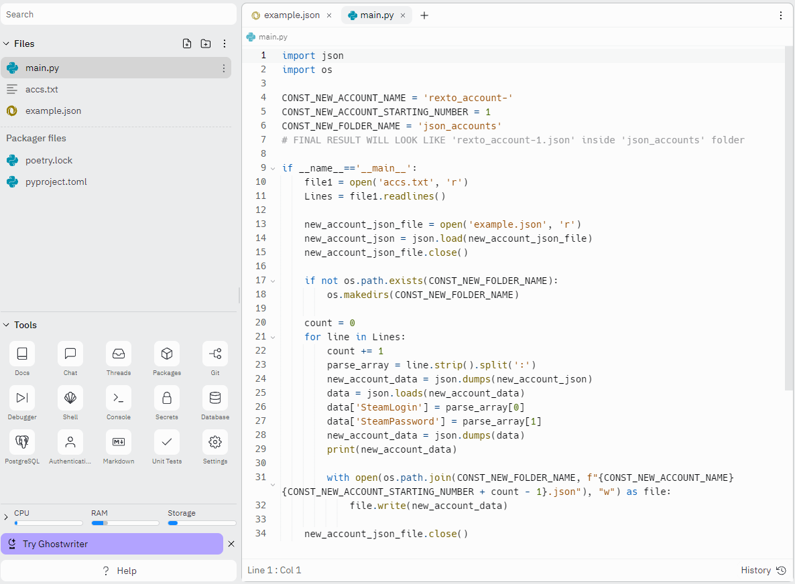

# Rexto_to_ASF

This is a simple converter from Rexto's accounts into json file, that allows you use those accounts in ASF. 

# HOW TO USE?
You need compiler such as https://replit.com.

Create -> Choose template Python -> Create Repl.

Drop all of repository files inside repl that you created, make sure that main file look's like this one.

Don't forget to drop your files inside accs.txt
If you want to switch name of new accounts or started number than change 4 or 5 string.

# IMPORTANT!!!

You can change a template of your .json file, but if you won't do that BE SURE THAT YOU CHANGED 10'TH STRING (SUPER IMPORTANT!!!).

Run file, wait a couple of seconds and receive new files inside 'json_accounts' folder.

If you want to ask me something or have some problems -> tg:@braverbe.
